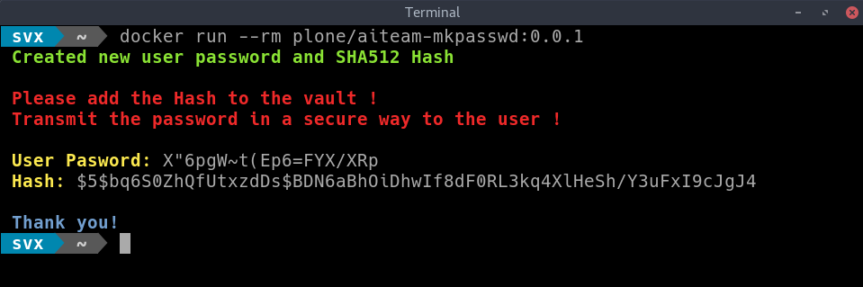

# aiteam-mkpasswd
Containerised Application For Creating Passwords and  SHA512 Hashes.

## Dependencies

- [Docker](https://docker.com "Homepage of docker")

## Features

- Uses [Tini](https://github.com/krallin/tini) as `init`.
- Uses [su-exec](https://github.com/ncopa/su-exec) for setting permissions.

## Documentation

Full documentation for end users can be found in the ["docs"](docs) folder.


## Getting Started

Pull the image:

``` bash
docker pull plone/aiteam-mkpasswd
```

## Usage

Run the container from command line:

```bash
docker run --rm plone/aiteam-mkpasswd:0.0.1
```



*Note*: In the example above we are using version *0.0.1*.

## Contribute

- [Issue Tracker](httos://github.com/plone/aiteam-mkpasswd/issues)
- [Source Code](https://github.com/plone/aiteam-mkpasswd)

## Support

If you are having issues, please let us know.

## License

The project is licensed under the GPLv2.

